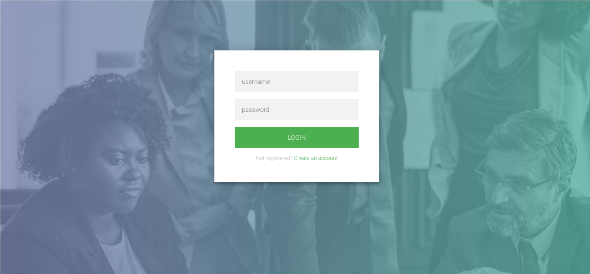
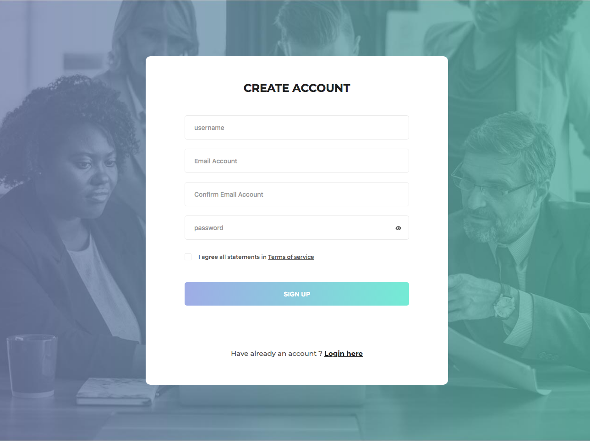

# Django Authentication
Django Authentication

# Screenshots
| Log In | Sign Up |
| ------ | ------- |
|  |  |


# Installation
---
## Clone the repo
```
git clone https://github.com/rumba09kamal/django-auth
```
## Create a virtual enviroment and install required dependencies as
```
virtualenv venv
source venv/bin/activate
pip install -r requirements.txt
```
## Apply migrations
```
cd django-auth/src/
python manage.py migrate
```

## Run development server as
```
python manage.py runserver
```

# Demo
http://localhost:8000
